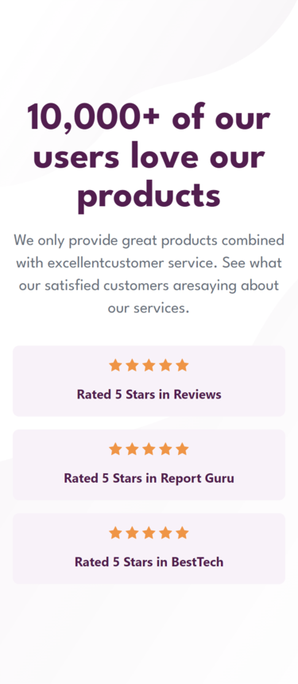
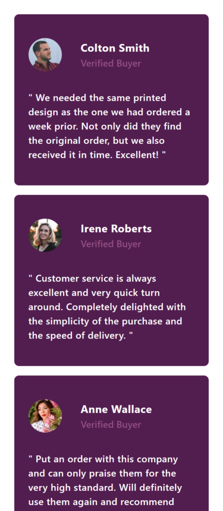

# Frontend Mentor - Social proof section

This is a solution to the [Social proof section challenge on Frontend Mentor](https://www.frontendmentor.io/challenges/social-proof-section-6e0qTv_bA/hub/social-proof-section-VfX8EtB2mS). Frontend Mentor challenges help you improve your coding skills by building realistic projects.

## Table of contents

- [Overview](#overview)
  - [The challenge](#the-challenge)
  - [Links](#links)
- [My process](#my-process)
  - [Built With](#built-with)
  - [Useful resources](#useful-resources)
- [Author](#author)
- [Screenshot](#screenshot)

## Overview

### The challenge

Users should be able to:

- View the optimal layout for the section depending on their device's screen size

### Links

- Solution URL: [GitHub Link](https://github.com/RamunnoAJ/fem-social-proof-section)
- Live Site URL: [Site Link](https://ramunnoaj.github.io/fem-social-proof-section/)

## My Process

### Built with

- React.js
- [Tailwind](https://sass-lang.com) - CSS utility library
- Mobile-first workflow

### Useful resources

- [First resource](https://nerdcave.com/tailwind-cheat-sheet) - This is a Cheat sheet for tailwind, it really helped me see what classes were doing and understand them better, I recommend it a lot.

## Author

- Website - [Agustín Ramunno](https://ramunnoaj.github.io/my-portfolio/)
- GitHub - [@RamunnoAJ](https://github.com/RamunnoAJ)
- Frontend Mentor - [@RamunnoAJ](https://www.frontendmentor.io/profile/RamunnoAJ)

## Screenshot

  

